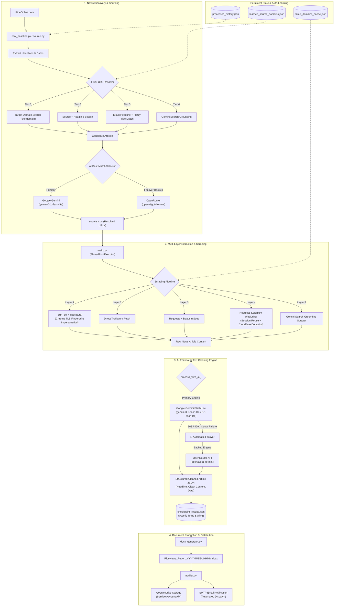

# 🌾 Rice Online News Aggregator & Report Generator

An automated agentic AI pipeline for discovering, scraping, cleaning, summarizing, and publishing global rice industry news. Built with a resilient multi-layer scraping architecture, hybrid dual-LLM fallback (Gemini + OpenRouter/GPT-4o-mini), and automated document distribution.

---

## 🏗️ System Architecture



---

## 🧩 Architectural Highlights & Key Subsystems

### 1. Dual-AI Engine with Seamless Failover (Gemini + OpenRouter)
* **Primary AI Engine (`Google Gemini`)**:
  * Utilizes `gemini-3.1-flash-lite` (or `gemini-3.5-flash-lite`) via the official `google.genai` SDK.
  * Fast JSON-mode responses with sub-second processing.
* **Secondary / Backup AI (`OpenRouter GPT-4o-mini`)**:
  * Integrated directly via HTTP REST API (`openai/gpt-4o-mini`).
  * Triggers automatically when Gemini hits temporary server spikes (`503 UNAVAILABLE`), daily free tier quotas (`429 RESOURCE_EXHAUSTED`), or network timeouts.
  * Zero-downtime execution: pipeline never aborts halfway through processing batches.

### 2. 5-Layer Resilient Web Scraping Pipeline
* **Layer 1: `curl_cffi` + Trafilatura**: Impersonates standard Chrome browser TLS fingerprints to bypass common anti-bot / Cloudflare blocks with minimal latency.
* **Layer 2: Trafilatura Direct**: High-efficiency fallback for clean metadata and structured paragraph extraction.
* **Layer 3: Requests + BeautifulSoup4**: DOM tree cleaning, removing navigational elements, scripts, ads, and footers.
* **Layer 4: Headless Selenium Chrome**: Dedicated session manager handling JavaScript-heavy sites with anti-automation suppression and session reuse.
* **Layer 5: Gemini Search Grounding**: Reads article content indexed in Google Web Cache / Search when direct HTTP scraping is blocked.

### 3. Smart Self-Learning Domain Manager
* **Auto-Discovery**: Tracks which news sources map to which domains and remembers them in `learned_source_domains.json`.
* **Domain Failure Cache**: When a domain repeatedly fails lightweight HTTP extraction, it is automatically fast-tracked to Selenium in `failed_domains_cache.json`.

### 4. Reliability & Production Safety
* **Thread-Safe Rate Limiter**: Controls API call frequency with thread slot reservation (`gemini_limiter`) avoiding burst limits.
* **Atomic File Writes**: All checkpoint saves use temporary files (`tempfile`) and atomic replacement (`os.replace`) to protect against corruption during unexpected exits.
* **Date & Deduplication Filters**: Eliminates outdated news (`OLD_NEWS_DAYS`) and previously processed headlines using hash sets.

---

## 📁 Repository Structure

```text
agent_riceonline_news/
│
├── config.py              # Centralized configuration, timeouts, model IDs, rate limits
├── source.py              # Discovery module (News Scout, 4-tier URL resolver)
├── main.py                # Production engine (Concurrency, scraping, AI editorial)
├── utils.py               # Shared helpers (RateLimiter, DomainCache, atomic writer)
├── docx_generator.py      # Word document compiler (.docx styling)
├── notifier.py            # Automated Google Drive upload and email notification
├── raw_headline.py        # Lightweight raw headline harvester from RiceOnline
│
├── data/                  # Persistent data & caches
│   ├── source.json                # Discovered and verified news candidate URLs
│   ├── checkpoint_results.json    # Incremental progress checkpoint
│   ├── learned_source_domains.json# Learned domain knowledge
│   └── failed_domains_cache.json  # Learned Selenium-required domains
│
├── logs/                  # Daily rotating log files (DEBUG & INFO levels)
│   └── rice_news_v1.log
│
├── tests/                 # Unit test suite (DomainManager, fuzzy matching, utils)
│   ├── test_source.py
│   └── test_utils.py
│
├── requirements.txt       # Python dependencies
└── .env                   # Environment secrets (API Keys, SMTP, Drive creds)
```

---

## ⚙️ Environment Configuration (`.env`)

Create a `.env` file in the root directory with the following variables:

```ini
# --- Primary AI (Google Gemini) ---
GEMINI_API_KEY=your_gemini_api_key_here

# --- Backup AI (OpenRouter) ---
OPEN_ROUTER_API_KEY=sk-or-v1-your_openrouter_api_key_here

# --- Google Custom Search (For URL Discovery) ---
GOOGLE_SEARCH_API_KEY=your_google_custom_search_key
GOOGLE_SEARCH_CX=your_custom_search_engine_id

# --- Distribution: Email Notifications (SMTP) ---
EMAIL_SENDER=your_email@gmail.com
EMAIL_PASSWORD=your_app_specific_password

# --- Distribution: Google Drive (Optional) ---
DRIVE_FOLDER_ID=your_google_drive_folder_id
GOOGLE_CREDENTIALS_JSON={"type": "service_account", ...}
```

---

## 🚀 Execution Guide

### 1. Install Dependencies
```bash
pip install -r requirements.txt
```

### 2. Run Tests
```bash
python -m unittest discover tests
```

### 3. Step 1: Discover & Resolve News Headlines
Scrapes RiceOnline.com, searches Google, and selects verified news URLs:
```bash
python source.py
```
*(Outputs candidates to `data/source.json`)*

### 4. Step 2: Scrape, Clean, and Generate Report
Runs the multi-layer extraction pipeline, cleans text with Gemini / OpenRouter, generates the `.docx` document, and dispatches email notifications:
```bash
python main.py
```
